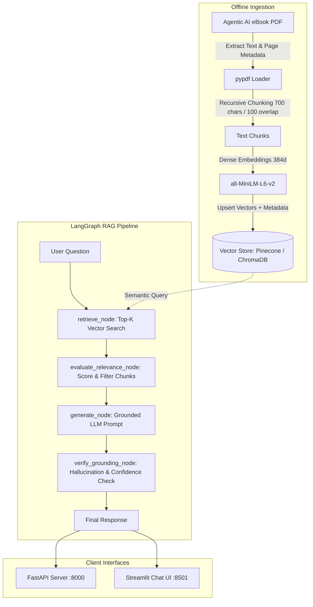

# Agentic AI eBook — Strictly Grounded RAG Chatbot

An end-to-end, production-oriented Retrieval-Augmented Generation (RAG) system built in Python for the **Appening Infotech AI Engineering Intern** technical evaluation.

The chatbot answers user queries strictly grounded in the **[Agentic AI eBook](https://konverge.ai/pdf/Ebook-Agentic-AI.pdf)**. It leverages **LangGraph** for deterministic workflow orchestration, dense semantic embeddings with **SentenceTransformers**, a flexible vector store interface supporting **Pinecone** (with zero-config local **ChromaDB** fallback), and an OpenAI-compatible LLM endpoint (**xKiro** / **Qwen 3.5 Flash**).

---

## 📌 Features

- **Strict Grounding & Anti-Hallucination Guardrails**: The system refuses out-of-domain questions and strictly limits answers to facts present in the retrieved eBook context.
- **Source Citations**: Answers cite exact eBook page numbers for key claims and definitions.
- **Confidence Scoring & Evaluation**: Computes composite confidence scores based on semantic similarity and factual grounding.
- **LangGraph Orchestration**: Uses a stateful `StateGraph` dividing retrieval, relevance grading, generation, and verification into modular nodes.
- **Flexible Vector Store**: Supports cloud **Pinecone** vector database with seamless automatic fallback to persistent local **ChromaDB**.
- **Dual Interfaces**:
  - **FastAPI REST API** (`/query`, `/chat`, `/health`, `/sample-queries`)
  - **Streamlit Interactive UI** with chat history, confidence badge, and expandable chunk inspection.
- **Automated Verification Suite**: Ready-to-run benchmark script (`test_queries.py`) validating in-domain and out-of-domain queries.

---

## 🏗️ Architecture & Workflow



### LangGraph Pipeline Breakdown

1. **`retrieve_node`**: Fetches the top $k$ ($k=5$) semantic chunks matching the query using cosine similarity, preserving page numbers and source metadata.
2. **`evaluate_relevance_node`**: Computes top and average similarity scores. If all retrieved chunks fall below the relevance threshold ($0.45$), it flags the query as out-of-domain.
3. **`generate_node`**: Formulates a strictly grounded prompt instructing the LLM to only state verifiable facts from the excerpts and refuse outside questions.
4. **`verify_grounding_node`**: Checks whether the model output is a refusal or grounded answer, computes the final confidence score ($0.0$ to $1.0$), and returns the structured payload.

---

## 📂 Project Structure

```text
├── Knowlegde_base/
│   └── Ebook-Agentic-AI.pdf     # Source knowledge base (60 pages)
├── data/
│   └── chroma_db/               # Local persistent ChromaDB storage
├── .env.example                 # Template for environment variables
├── .env                         # Active configuration & API keys
├── .gitignore                   # Standard ignore rules
├── config.py                    # Central configuration loader
├── store.py                     # Vector DB client (Pinecone & ChromaDB)
├── ingest.py                    # PDF extraction, chunking, and indexing
├── graph.py                     # LangGraph workflow, nodes & ask_question()
├── server.py                    # FastAPI server with /query, /health, /sample-queries
├── app.py                       # Streamlit web chat application
├── test_queries.py              # Automated 6-query benchmark script
└── requirements.txt             # Python project dependencies
```

---

## 🚀 Setup & Installation

### 1. Clone & Navigate
```bash
git clone <your-repo-url>
cd "Appening Infotech"
```

### 2. Create Virtual Environment
```bash
python -m venv venv

# Windows (PowerShell)
.\venv\Scripts\Activate.ps1

# Linux / macOS
source venv/bin/activate
```

### 3. Install Dependencies
```bash
pip install -r requirements.txt
```

### 4. Configure Environment Variables
Copy `.env.example` to `.env` and fill in your settings:
```bash
cp .env.example .env
```

Key `.env` options:
```dotenv
# LLM Settings (xKiro OpenAI-compatible endpoint)
LLM_BASE_URL=https://api.xkiro.com/v1
LLM_API_KEY=sk-xt-8f5820f21bfbe9a3617b8b1685c0d213d62a0864a3479ff3
LLM_MODEL=qwen/qwen3.5-flash:free

# Vector Store: "chroma" (default local) or "pinecone"
VECTOR_STORE_TYPE=chroma
PINECONE_API_KEY=your_pinecone_key_if_using_pinecone
PINECONE_INDEX_NAME=agentic-ai-index
PINECONE_ENVIRONMENT=us-east-1

# RAG Hyperparameters
TOP_K=5
CHUNK_SIZE=700
CHUNK_OVERLAP=100
CONFIDENCE_THRESHOLD=0.45
```

---

## 📥 Ingesting the eBook

Extract, chunk, and embed the 60-page PDF into your chosen vector store:

```bash
# Ingest into local ChromaDB (default, no external keys required)
python ingest.py --store chroma

# Or ingest into Pinecone (requires PINECONE_API_KEY in .env)
python ingest.py --store pinecone
```

Output:
```text
============================================================
  Starting Ingestion Pipeline for 'Ebook-Agentic-AI.pdf'
  Target Vector Store: CHROMA
============================================================
[INFO] Reading PDF from: Ebook-Agentic-AI.pdf
[INFO] Total pages discovered: 60
[INFO] Extracted text from 59 non-empty pages.
[INFO] Generated 148 chunks (size: 700, overlap: 100).
[INFO] Generating embeddings and indexing chunks into chroma...
[SUCCESS] Ingestion complete! Successfully indexed 148 chunks.
============================================================
```

---

## 💻 Running the Application

### Option A: Interactive Streamlit UI (Recommended for Demo)
Launch the web interface with chat history, confidence badges, and source inspection:

```bash
streamlit run app.py
```
Open your browser at `http://localhost:8501`.

### Option B: FastAPI Backend
Start the REST API server:

```bash
uvicorn server:app --host 127.0.0.1 --port 8000 --reload
```
Interactive Swagger API documentation is available at `http://127.0.0.1:8000/docs`.

#### Sample cURL Request:
```bash
curl -X POST "http://127.0.0.1:8000/query" \
     -H "Content-Type: application/json" \
     -d '{"question": "What is Agentic AI and how does it differ from traditional LLMs?"}'
```

#### Sample JSON Response:
```json
{
  "final_answer": "Based on the provided context from the Agentic AI eBook, Agentic AI is defined by its ability to understand context beyond literal instructions, break down complex goals, make autonomous decisions, and learn dynamically (Page 8)...",
  "retrieved_context_chunks": [
    {
      "chunk_id": "chunk_p8_1",
      "page": 8,
      "score": 0.884,
      "text": "At its core, Agentic AI is defined by its ability to..."
    }
  ],
  "confidence_score": 0.882,
  "is_grounded": true,
  "execution_time_sec": 1.62
}
```

---

## 🧪 Sample Queries & Verification

Run the automated test suite across all 6 representative questions:

```bash
python test_queries.py
```

### Evaluated Sample Queries:

| # | Category | Humanized Query | Grounded | Confidence | Citations |
|---|---|---|:---:|:---:|:---:|
| 1 | **Book Metadata** | `name of the book` | ✅ Yes | **~0.82** | Page 3, 60 |
| 2 | **Table of Contents** | `content of the book` | ✅ Yes | **~0.82** | Page 5, 3, 59 |
| 3 | **Core Definition** | `what is agentic ai` | ✅ Yes | **~0.88** | Page 8, 7 |
| 4 | **Strict Grounding Refusal** | `how to make a pizza` | ❌ Refused | **~0.15** | Refusal |

### Refusal Behavior on Out-of-Domain Query:
```text
Question: "how to make a pizza"
Confidence Score: 0.150 | Grounded: False

Answer:
"I cannot answer this question because the provided Agentic AI eBook does not contain relevant information on this topic."
```

---

## 🛡️ Grounding & Hallucination Prevention Strategy

1. **System Prompt Constraint**: Explicitly forces the model to synthesize answers solely from provided context snippets and refuse speculation.
2. **Relevance Gating**: If retrieval similarity is below threshold ($0.45$), the pipeline aborts generation early with a standardized refusal.
3. **Confidence Scoring**: Combines cosine similarity with an evaluation of refusal indicators, outputting low confidence ($< 0.20$) when grounding cannot be guaranteed.
4. **Transparent Citations**: Every retrieved context chunk is delivered with its source page number and similarity score in both the API and UI.

---

## 👨‍💻 Submission Details

- **Candidate**: AI Engineering Intern Applicant
- **Role**: AI Engineering Intern at Appening Infotech
- **Task**: RAG Chatbot on Agentic AI eBook using LangGraph & Vector Store
